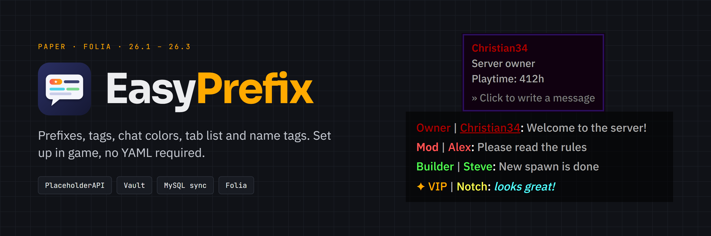

<p align="center">
  
</p>

<p align="center">
  <b>Prefixes, suffixes, tags, chat colors, tab list and name tags for Paper - configured in a GUI.</b>
</p>

<p align="center">
  <a href="https://modrinth.com/plugin/easyprefix-christian34">Modrinth</a> ·
  <a href="https://hangar.papermc.io/Christian34/EasyPrefixGUI">Hangar</a> ·
  <a href="https://www.spigotmc.org/resources/easyprefix-prefix-chat-color-tab-list-gui.44580/">SpigotMC</a> ·
  <a href="https://github.com/itsthechris07/EasyPrefix/releases">Releases</a> ·
  <a href="https://itsthechris07.github.io/EasyPrefix/">Documentation</a>
</p>

---

EasyPrefix formats your chat without a big permission or chat plugin setup: create groups with a prefix, suffix and
chat color, give players the permission `EasyPrefix.group.<name>` and you are done. Everything can be changed in game
with `/ep setup`, players pick their own chat color with `/color`.

## Features

- **Groups** with prefix, suffix, chat color, formatting, join/quit message, chat hover and a priority
- **Tags** - extra titles players switch between with `/tags`
- **Chat colors and formattings** - the 16 Minecraft colors, gradients, rainbow, shadows; per color permissions
- **Custom prefixes and suffixes** players type in themselves, with a cooldown and a blacklist
- **Chat hover and click** on player names, **@mentions** with sound and highlight, clickable links
- **Tab list and name tags** with prefix and suffix, tab list sorted by group priority
- **MiniMessage and legacy colors** (`<gradient:red:gold>`, `<#ff5555>`, `&c`) everywhere
- **GUIs** for players (`/ep settings`, `/color`) and admins (`/ep setup`), texts entered in a Paper dialog with a live preview
- **MySQL** to share groups, users and settings between several servers, otherwise SQLite - no setup needed
- **PlaceholderAPI** placeholders and a **Vault** chat provider for other plugins
- **Folia** support - one jar for Paper and Folia

## Requirements

| | |
|---|---|
| Server | [Paper](https://papermc.io) or [Folia](https://papermc.io/software/folia) **1.21.7 - 26.x** |
| Java | the version your Paper build needs (21 for 1.21.x) |
| Optional | [PlaceholderAPI](https://modrinth.com/plugin/placeholderapi), [Vault](https://www.spigotmc.org/resources/vault.34315/) / VaultUnlocked, a permission plugin like [LuckPerms](https://luckperms.net) |

Spigot and older Minecraft versions are not supported by this version.

## Quick start

1. Download the jar from [Modrinth](https://modrinth.com/plugin/easyprefix-christian34),
   [Hangar](https://hangar.papermc.io/Christian34/EasyPrefixGUI) or the
   [GitHub releases](https://github.com/itsthechris07/EasyPrefix/releases) and put it into `plugins/`.
2. Start the server. EasyPrefix creates `plugins/EasyPrefix/` with `config.yml`, `groups.yml` and `messages.yml`.
3. Give your players a group, e.g. with LuckPerms:
   ```
   /lp group admin permission set EasyPrefix.group.Admin true
   ```
4. Run `/ep setup` in game to edit groups, tags and settings, or edit `groups.yml` and run `/ep reload`.

Players without a group permission get the `default` group. More in [Getting started](docs/getting-started.md).

## Documentation

Read it on **[itsthechris07.github.io/EasyPrefix](https://itsthechris07.github.io/EasyPrefix/)** or right here:

| | |
|---|---|
| [Getting started](docs/getting-started.md) | Installation, first group, updating |
| [Commands](docs/commands.md) | All commands with their permissions |
| [Permissions](docs/permissions.md) | Groups, tags, colors, custom prefixes |
| [Groups and tags](docs/groups-and-tags.md) | `groups.yml`: prefixes, priority, hover, join/quit messages |
| [Colors and formatting](docs/colors-and-formatting.md) | Chat colors, effects, text formats, custom prefixes |
| [Configuration](docs/configuration.md) | Every option of `config.yml` |
| [Tab list and name tags](docs/tab-list-and-name-tags.md) | Layouts, sorting, excluded worlds |
| [Placeholders and integrations](docs/placeholders.md) | PlaceholderAPI, Vault, other chat plugins |
| [MySQL and multiple servers](docs/mysql.md) | Sharing data between servers |
| [FAQ and troubleshooting](docs/faq.md) | Common problems |
| [Development](docs/development.md) | Building and testing EasyPrefix |

## Support

Found a bug? Open an [issue](https://github.com/itsthechris07/EasyPrefix/issues) and fill in the template - include
the output of `/ep debug` and your server version.

## License

EasyPrefix is licensed under the [MIT License](LICENSE). It collects anonymous usage statistics with
[bStats](https://bstats.org), which can be turned off in `plugins/bStats/config.yml`.
